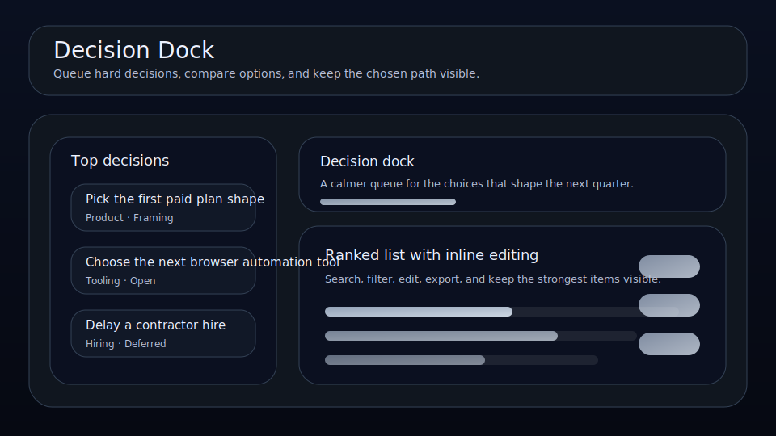

# Decision Dock

Queue hard decisions, compare options, and keep the chosen path visible.



Decision Dock is a local-first workspace for founders, operators, and solo builders who want a cleaner way to manage decisions. It keeps conviction, owner, next step, and review timing visible so the right things move forward with less drift.

## What it does

- ranks decisions by leverage, conviction, timing, and friction
- tracks **owner**, **next step**, **review date**, and **conviction** for each decision
- highlights the best current bet, the next review slot, and the strongest signal on the board
- renders a dedicated queue plus a category mix snapshot beneath the main board
- saves locally in the browser with JSON import/export backups
- quick action: **Compare options**
- quick action: **Raise conviction**
- quick action: **Choose path**

## Why it feels different

Decision Dock is not just a generic list. It is shaped around the real workflow behind decisions, so the board helps you decide what matters next instead of simply storing records.

## Quick start

```bash
git clone https://github.com/get2salam/decision-dock.git
cd decision-dock
python -m http.server 8000
```

Then open <http://localhost:8000>.

## Runnable review briefing example

Decision Dock exports are plain JSON, so the same backup can feed a quick review briefing before a planning meeting. The example below reuses the import-safety helpers, ranks active decisions with the app's scoring shape, and prints the next three calls that need attention.

Run it with the built-in sample data:

```bash
npm run example:briefing
```

Or pass a JSON file exported from the app:

```bash
node examples/review-briefing.mjs ./decision-dock.json
```

Expected sample output starts with:

```text
Decision Dock review briefing
Reference date: 2026-04-24
Active decisions: 2
```

## Keyboard shortcuts

- `N` creates a new decision
- `/` focuses the search box

## Privacy

Everything stays in your browser unless you export a JSON backup.

## Tests

Pure helpers that guard the JSON import boundary (string length caps, ISO date validation, item-count limits) ship with a [node:test](https://nodejs.org/api/test.html) suite:

```bash
npm test
```

For the same zero-install check used by CI, run:

```bash
npm run verify
```

The GitHub Actions workflow runs this command on pushes and pull requests against `main`, so a contributor can verify the same contract locally before opening a PR.

## License

MIT
